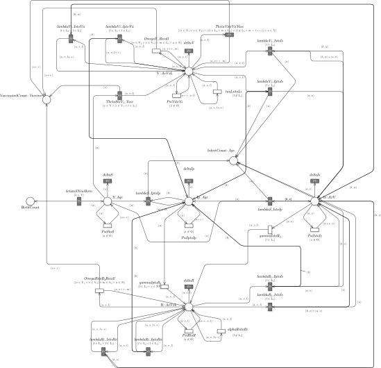

-   [Introduction](#introduction)
-   [How to start](#how-to-start)
    -   [Something to know](#something-to-know)
-   [Cases of study](#cases-of-study)
    -   [Pertussis Model](#pertussis-model)
    -   [Model Generation](#model-generation)
    -   [Sensitivity analysis](#subsec:PRCCpertussis)
    -   [Model Calibration](#ubsec:calibrationPertussis)
    -   [Model Analysis](#model-analysis)
-   [References](#references)

Introduction
============

In this document we describe how to use the R library *epimod*. In
details, *epimod* implements a new general modeling framework to study
epidemiological systems, whose novelties and strengths are:

1.  the use of a graphical formalism to simplify the model creation
    phase;
2.  the automatic generation of the deterministic and stochastic process
    underlying the system under study;
3.  the implementation of an R package providing a friendly interface to
    access the analysis techniques implemented in the framework;
4.  a high level of portability and reproducibility granted by the
    containerization (Veiga Leprevost et al. 2017) of all analysis
    techniques implemented in the framework;
5.  a well-defined schema and related infrastructure to allow users to
    easily integrate their own analysis workflow in the framework.

The effectiveness of this framework is showed through two case studies,
the wellknown and simple SIR model, and much more complex model related
to the pertussis epidemiology in Italy.

How to start
============

Install *epimod*:

    install.packages("devtools")
    library(devtools)
    install_github("qBioTurin/epimod", dependencies=TRUE)

    library(epimod)

Then, the following function must be used to download all the docker
images used by *epimod*:

    downloadContainers()

Something to know
-----------------

All the *epimod* functions print the following information:

-   *Docker ID*, that is the CONTAINER ID which is executed by the
    functon;
-   *Docker exit status*, if 0 then the execution completed with
    success, otherwise an error log file is saved in the working
    directory.

Cases of study
==============

### Pertussis Model

We now describe how the framework functions can be combined to obtain an
analysis workflow for the Pertussis model introduced in the main paper:
*A computational framework for modeling andstudying pertussis
epidemiology and vaccination*.

 Petri Net representation of the Pertussis model.

We first introduce all the functions, the constants, and the numerical
values associated with the general transitions rate (the black boxes in
figure ). Then, we show the proposed framework and how it can be
successfully used to study and analyze pertussis infection and the
relative vaccination cycle in Italy. All the details regarding the
function associated to the general transition and the parameters
exploited in the simulations are reported in the *ReadMe.pdf* into the
folder **pdf**.

### Model Generation

The starting point is the derivation from the Pertussis model the
corresponding underlying stochastic and deterministic processes by using
the function *model\_generation*. Then the derived deterministic process
is represented by a system of 179 ODEs, while the derived stochastic
process is characterized by 1965 possible events. Let us observe that
the functions associated with the general transitions (the black boxes
in figure ) are implemented in the file *transitions.cpp*, which is
passed as input parameter of the function.

    generation <- model_generation(net_fname = "./Net/Pertussis.PNPRO",
                                   functions_fname = "./Cpp/transitions.cpp")

### Sensitivity analysis

Since the model is characterized by 15 unknown parameters, three of the
represent the probabilities of having (i) the *susceptible infection
success*, i.e., the infection of a susceptible individual due to a
contact with an infected individual, namely *prob\_infectionS*, (ii) the
*resistant infection success*, i.e., the infection of a vaccinated or
recovered individual with the minimum resistance level due to a contact
with an infected individual, namely *prob\_infectionR\_l1*, and finally
(iii) *the natural boosts*, i.e., the restoring of the resistance level
to the maximum when a person with resistance level different from the
minimum level comes into contact with an infected individual, namely
*prob\_boost*. The remaining 12 unknown parameters are the initial
marking of the susceptible and recovered places. We can apply the
function *sensitivity\_analysis()* on the deterministic process
previously generated and considering the data of the period from 1974 to
1994 as reference targets, in order to identify which parameters are
most sensitive w.r.t. the counts of infects. Therefore, the following
function input parameters are passed:

1.  **solver\_fname**: *Pertussis.solver*;
2.  **n\_config**: the model is run *2^14*;
3.  **f\_time**: since all the rates were calculated daily and we want
    to simulate 21 years, then the *f\_time* has to be *365\*21*;
4.  **s\_time**: the step time is set to 1 year, *365* days;
5.  **parameters\_fname**: in *Functions\_list.csv* the parameters which
    have to vary and also the parameters that have to be passed to the
    general functions stored in *transition.cpp* are reported.

<!-- -->

    #>   Tag          Name        Function
    #> 1   g       b_rates          b_rate
    #> 2   g       c_rates          c_rate
    #> 3   g       d_rates          d_rate
    #> 4   g       v_rates          v_rate
    #> 5   g probabilities     probability
    #> 6   i          init initial_marking
    #>                                       Parameter1
    #> 1 file='/home/docker/data/input/init_conf.RData'
    #> 2 file='/home/docker/data/input/init_conf.RData'
    #> 3 file='/home/docker/data/input/init_conf.RData'
    #> 4 file='/home/docker/data/input/init_conf.RData'
    #> 5 file='/home/docker/data/input/init_conf.RData'
    #> 6 file='/home/docker/data/input/init_conf.RData'

1.  **functions\_fname**: in *Functions.R* the functions reported in the
    third column of *Functions\_list.csv* are implemented. For instance,
    the function associated to the generation of the three probabilities
    is defined as follows:

<!-- -->

    # if x is null then it means that we have to sample the values by
    # exploiting the uniform distribution between 0 and 0.25. Let us note
    # that three values corresponding to the three probabilities are
    # generated since the uniform intervals are all identical to [0,0.25].
    # Differtly when x is not null, then it means the we are using the
    # optimization algorithm and the prob. values are already sampled,
    # for this reason we take just the first three values of x (the vector
    # with size equals to the number of parameter which are varing),
    # 0 is given to the probability of vaccination failure that will be used
    # in model_analyis.
    # The three values obtained are automatically saved in a file called as
    # the corresponding name in the Function_list.csv (second column),
    # and then read and exploited by the functions in transitions.cpp .

    probability <- function(file, x = NULL)
    {
        load(file)
        if( is.null(x) ){
            x <- runif(n = length(probabilities), min=0, max=0.25)
            x[length(x)] = 0
        }
        else{
            x <- c(x[c(1:3)],0)
        }
        return(matrix(x, ncol = 1))
    }

Let us note that the probabilities values generated are used by the
functions modeling all the transitions representing the contact between
two individuals (implemented in *transitions.cpp*). For this reason the
tag associated with this parameter is *g* and not *p* (where *p* has to
be used when a transition rate or a single place is under analysis).
Similarly, the function *initial\_marking* characterizing the generation
of the unknown initial markings of certain places is defined in order to
satisfy the following constraints: Hence, the values estimated during
the sensitivity analysis and model calibration steps are the proportions
of the total number in each age class. For instance, the values .4 and
.8 might be associated to *S*\_*a*1 and *R*\_*a*1\_*n**v*\_*l*4, meaning
that the 0.3333333% (i.e., .4/(.4+.8) ) of the total 866703 individuals
are in S\_a1 and the remaining are in R\_a1\_nv\_l4. For more details
regarding the constraints in eqs. and the functions associated to the
general transitions (in specific how the probabilities are used), see
Sec. [General transitions](#Sec:generalTr), eq. . 7.
**target\_value\_fname**: since we are interested to calculate the PRCCs
over the time w.r.t. the count of infects per year, the *Select.R* file
provides the function to obtain the vector storing the total number of
infections per year.

    Select<-function(output)
    {
      ynames <- names(output)
      col_names <- "(InfectCount_a){1}[0-9]{1}"
      col_idxs <- c( which(ynames %in% grep(col_names, ynames, value=T)) )
      # Reshape the vector to a row vector
      ret <- rowSums(output[,col_idxs])
      return(as.data.frame(ret))
    }

1.  **reference\_data**: the Pertussis surveillance data from the 1974;

<!-- -->

    #>         1974  1975  1976 1977  1978  1979  1980
    #> Infects 7413 10786 18354 8076 12582 18142 14170

1.  **distance\_measure\_fname**: the squared error estimator via
    trajectory matching on the number of cases per year is implemented
    through the *msqd()* function.

<!-- -->

    msqd<-function(reference, output)
    {
        ynames <- names(output)
        # InfectCount is the place that counts how many new infects occurs during the whole
        # period, for this reason we have to do the difference to obtain the number of cases
        # per year. Given this difference the squared error is calculated w.r.t. the reference
        # data.
        col_names <- "(InfectCount_a){1}[0-9]{1}"
        col_idxs <- c( which(ynames %in% grep(col_names, ynames, value=T)) )
        infects <- rowSums(output[,col_idxs])
        infects <- infects[-1]
        diff<-c(infects[1],diff(infects,differences = 1))
        ret <- sum(( diff - reference )^2 )
        return(ret)
    }

Finally,

    sensitivity_analysis(n_config = 2^14,
                         parameters_fname = "./input/Functions_list.csv",
                         functions_fname = "./Rfunction/Functions.R",
                         solver_fname = "./Net/Pertussis.solver",
                         f_time = 365*21,
                         s_time = 365,
                         timeout = "1d",
                         parallel_processors=40,
                         reference_data ="./input/reference_data.csv",
                         distance_measure_fname="./Rfunction/msqd.R",
                         target_value_fname="./Rfunction/Select.R"
                         )

 PRCCs values for the selected input parameters with respect the number
of infections.

From figure it is straightforward to argue that the *prob\_infectionS*
is the most important parameter affecting the *infects* behavior,
followed by *prob\_infectionR\_l1*. Differently the *prob\_boost*
probability and the initial number of susceptible and recovered
individuals in each age class are irrelevant with respect to the
infection behavior.

 Scatter Plot showing the squared error between the real and simulated
infection cases.

In figure , the squared error between the real and simulated infection
cases from 1974 to 1994 are plotted varying the *prob\_infectionS*
parameter (on the x-axis) and *prob\_infectionR\_l1* parameter (on the
y-axis). Each point is then colored according to a linear gradient
function starting from color dark blue (i.e., lower value) and moving to
color light blue (i.e., higher values). From this plot we can observe
that higher squared errors are obtained when *prob\_infectionS* assumes
values greater than 0.09 (see light blue) or smaller than 0.06 (see the
dark blue points, representing the parameters configuration with minimum
error w.r.t. the real data, when *prob\_infectionS* values are between
\[0; 0.1\]). Therefore, according to this we shrunk the search space
associated with the *prob\_infectionS* parameter from \[0; 0.25\] to
\[0; 0.1\] in the calibration phase.

### Model Calibration

The aim of this phase is to adjust the model unknown parameters to have
the best fit of simulated behaviors to the real data, i.e. the reference
data. Firstly, the function *model\_calibration()* is applied on the
generated deterministic process to fit its behavior to the real
infection data (from 1974 to 1994) using squared error estimator via
trajectory matching implemented in the function *msqd()* passed as an
input parameter. Note that the information derived by the sensitivity
analysis is exploited to reduce, where it is possible, the number of
parameters to be estimated and/or their search space.

    model_calibration(parameters_fname = "./input/Functions_list.csv",
                      functions_fname = "./Rfunction/Functions.R",
                      solver_fname = "./Net/Pertussis.solver",
                      f_time = 365*21,
                      s_time = 365,
                      reference_data = "./input/reference_data.csv",
                      distance_measure_fname = "./Rfunction/msqd.R",
                      # Vectors to control the optimization
                      # init_V taken from trace id 13521
                      ini_v = c(0.05, 0.07, 0.1, 1, 0, 1, 0, 0, 0, 0, 1, 0, 0, 0, 0),
                      ub_v = c(0.25, 0.1, 0.25, 1, 1, 1, 1, 1, 1, 1, 1, 1, 1, 1, 1),
                      lb_v = c(0, 0, 0, 1e-7, 1e-7, 1e-7, 1e-7, 1e-7, 1e-7, 1e-7,
                               1e-7, 1e-7, 1e-7, 1e-7, 1e-7),
                      ini_vector_mod = TRUE
                      )

    #> Optimal configuration:
    #>       prob_boost prob_infectionS prob_infectionR_l1 init_S_a1  init_S_a2
    #> 87160 0.09328468      0.06742504         0.09999983 0.3362519 0.04485452
    #>       init_S_a3 init_R_a1_nv_l4 init_R_a2_nv_l1 init_R_a2_nv_l2 init_R_a2_nv_l3
    #> 87160  0.968471       0.3454245      0.02239408      0.01690299           1e-07
    #>       init_R_a2_nv_l4 init_R_a3_nv_l1 init_R_a3_nv_l2 init_R_a3_nv_l3
    #> 87160       0.9765406       0.3134586      0.06156321    0.0007210937
    #>       init_R_a3_nv_l4
    #> 87160    0.0001294989

 Model Calibration considering the deterministic model. Here a subset of
the trajectories obtained from the optimization phase. The color of each
trajectory depends on the squared error w.r.t. the Pertussis
surveillance trend (red line). The black line is the optimal one.

Then, starting from the parameters configuration obtained from the
deterministic model calibration, that is

`0.0932847, 0.067425, 0.0999998, 0.3362519, 0.0448545, 0.968471, 0.3454245, 0.0223941, 0.016903, 10^{-7}, 0.9765406, 0.3134586, 0.0615632, 7.210937\times 10^{-4}, 1.294989\times 10^{-4}`

the function *model\_calibration()* is applied on the generated
stochastic process to fit its behavior to the real infection data using
Akaike Information Criterion (AIC) via trajectory matching, implemented
in the R script *aic.R*. Let us note that the parameter search space of
this second optimization step is computed from the result obtained from
the previous step considering a 20% confidence interval around each
parameter value.

    model_calibration(parameters_fname = "./input/Functions_list.csv",
                      functions_fname = "./Rfunction/Functions.R",
                      solver_fname = "./Net/Pertussis.solver",
                      solver_type = "TAUG",
                      f_time = 365*21,
                      s_time = 365,
                      n_run = 250,
                      parallel_processors=40,
                      reference_data = "./input/reference_data.csv",
                      distance_measure_fname = "./Rfunction/aic.R",
                      ini_v = best_run,
                      ub_v = 1.2*best_run,
                      lb_v = .8*best_run,
                      ini_vector_mod = TRUE
                      )

    #> [1] "Optimal configuration="
    #>     prob_boost prob_infectionS prob_infectionR_l1 init_S_a1  init_S_a2
    #> 726  0.1028314      0.06422971          0.1173022 0.3996977 0.04611963
    #>     init_S_a3 init_R_a1_nv_l4 init_R_a2_nv_l1 init_R_a2_nv_l2 init_R_a2_nv_l3
    #> 726  1.082384       0.2943042      0.02526472      0.01475493    8.009888e-08
    #>     init_R_a2_nv_l4 init_R_a3_nv_l1 init_R_a3_nv_l2 init_R_a3_nv_l3
    #> 726       0.9688963       0.3208456      0.06788778     0.000676801
    #>     init_R_a3_nv_l4
    #> 726    0.0001424256

 a) 25000 trajectories (grey) over the whole time interval are reported.
b) Boxplots considering the best configuration.

Figure shows trajectories (grey lines) for the 15 best parameters
configurations discovered. The blue area contains the average
trajectories derived for the first ten best parameter configurations,
while the two green lines provide the associated confidence interval. We
can observe that a good approximation of the surveillance data (red
line) from the 1974 to 1994 is obtained.

### Model Analysis

In this last phase of our workflow the user can analyse the calibrated
model to answer specific questions and to derive new insights. In our
case study we show a simple what-if analysis. In particular we
investigate the impact of different vaccination failure probabilities
with respect to the number of infection cases. The simulated time period
is from 1974 to 2016, and the pertussis vaccination program is started
in 1995, with an average vaccination coverage starts from 50% and
transitions linearly to 95% in 8 years, (“Ministero Della Salute.
Coperture Vaccinali.” n.d., @Tozzi2014).

In details, the *model\_analysis()* function is applied by exploiting
the optimal parameters configuration derived from the calibration
analysis on the stochastic model, namely *optim.stoch*.

    model_analysis(solver_fname =  "./Net/Pertussis.solver",
                   f_time = 365*43,
                   s_time = 365,
                   n_config = 1,
                   n_run = 250,
                   parallel_processors = 40,
                   solver_type = "TAUG",
                   parameters_fname = "./input/Functions_list.csv",
                   functions_fname = "./input/Functions.R",
                   ini_v = optim.stoch ,
                   ini_vector_mod = TRUE)

 250 trajectories (grey) considering the stochastic model. The blue
dashed line is the mean trend and the red one the Pertussis
surveillance.

 Probability of vaccine failure settled to .1.

 Probability of vaccine failure settled to .2.

Fig. shows the decreasing of number of infection cases after the
starting of the vaccination policy, with dynamics comparable with the
reference data. If we add to the model a vaccination failure
probability, i.e. we add a fourth probability given by *p**v*
(see Sec.[General transitions](#Sec:generalTr), eq. ), then we have to
modify the vector returned by the function *probability()* implemented
in *Functions.R* as follows:

    probability <- function(file, x = NULL)
    {
        load(file)
        if( is.null(x) ){
            x <- runif(n = length(probabilities), min=0, max=0.25)
            x[length(x)] = 0
        }
        else{
        ##### Here we add the vaccination failure probability: p_v
            x <- c(x[c(1:3)],p_v)
        }
        return(matrix(x, ncol = 1))
    }

In figures and we show how the number of infection cases is affected by
the increasing vaccination failure probabilities from 0.1 to 0.20. We
can observe that only probabilities greater than 0.10 have an effect on
the number of infection cases.

Figures , , and show a) 250 trajectories (grey) considering the
stochastic model over the whole time interval. The blue dashed line
represents the mean trend; the red line represents the Pertussis
surveillance trend. In the picture b) the boxplots over the time period
are plotted, and in c) the zoom considering the last 21 years is
reported.

References
==========

Gonfiantini, M V, E Carloni, F Gesualdo, E Pandolfi, E Agricola, E
Rizzuto, S Iannazzo, M L Ciofi Degli Atti, A Villani, and A E Tozzi.
2014. “Epidemiology of Pertussis in Italy: Disease Trends over the Last
Century.” *Eurosurveillance* 19 (40).

“Ministero Della Salute. Coperture Vaccinali.” n.d.

Veiga Leprevost, Felipe da, Björn A Grüning, Saulo Alves Aflitos, Hannes
L Röst, Julian Uszkoreit, Harald Barsnes, Marc Vaudel, et al. 2017.
“BioContainers: an open-source and community-driven framework for
software standardization.” *Bioinformatics* 33 (16): 2580–2.
